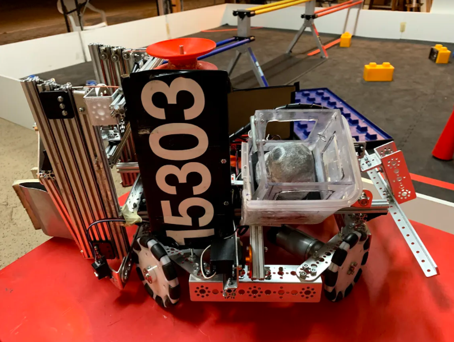
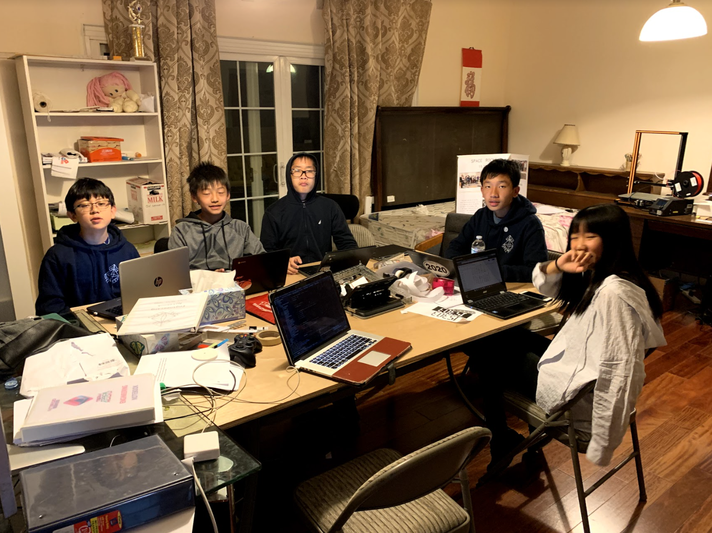
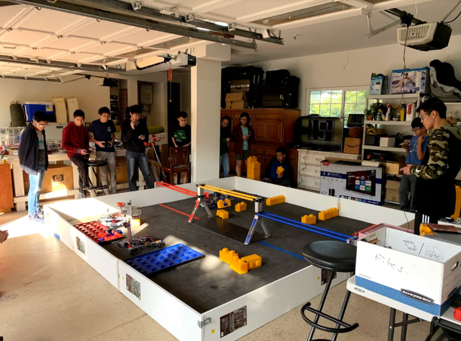

---
---

  <h1> Team Space Rocks 15303 </h1>
  
  <h1> About Us </h1>  
  
               

               15303 Space Rocks is a fourth-year FTC team consisting of a group of high school students who are passionate about robots, science, technology,       
               engineering, and mathematics. 
               

  <h2> Mission </h2>

               

               To use science and technology to discover and challenge ourselves. 
               

  <h2>Vision</h2>

               

               We are trying to help younger generations to acquire knowledge and develop skills in the STEM field along with communication, collaboration, and     
               leadership skills through designing, implementing and advancing.
               

  <h2>Strategy</h2>

            

            We want to discover and learn through hands-on 
            engineering activities. Have everyone contribute to team success by assigning specific leader roles. Execute with discipline. Make rapid development and                 quick iterations. Be respectful, maintain gracious professionalism, and help each other. Last but not least, have fun!
            

  <h2>Values</h2>

            

              Discovery
               
              Innovation
               
              Teamwork
               
              Enjoyment
            

  
  <h1> Basic Information </h1>
    
    
  <h2>Name</h2>
          
15303 Space Rocks

  <h2>Location</h2>
          
Arcadia, CA

  <h2>Members</h2>

<!--

  
- Simon Pei			  Coach

- Charles Pei		          Capt./Assist. Coach

- Kevin Tan			

- Xing Liu

- Jennifer Wong	

- Andrew Habata		

- Faith Hockens

- Ella Tang

- Shin Umeda

- John Bee

    
-->

 <h2>Budget</h2>
    

    As of now, the team is fully funded with member 
    Contributions. We are currently reaching out for
    more fundings for the current term. We are also
    planning on asking for fundings from nearby shops
    and stores.
    

<h1>History</h1>

 

Team Space Rocks was started by coach Simon Pei in September of 2018, along with his two children and three other members. From 2018-2020, team members met at coach Simon’s house weekly to design and build the robot. Each member was assigned specific roles and held important roles in the team. 

    
 <h2> Competitons </h2>
 <h3> 2018 - 2019 </h3>
  
       
 
      Our robot competed in all of the League meets, allowing the team to gain lots of experience, make numerous modifications, and develop better strategies. Since the        initial design, we’ve made many changes to the robot. In the end, the improvements helped Team Rocks to rank 4th overall. 
       

 
 <h3>2019-2020</h3>
      

      Our robot continued to compete 
      in all of the League meets, using past knowledge along with newly gained information to develop better strategies. Many changes were done to the robot after the         initial design was established. With these new improvements, Team Space Rocks was able to frequently get top 5’s in competitions. Moreover, as only a second-year         robotics team, we were able to win the LA Interleague tournament as the first alliance’s first pick.
      

<h1> Community Outreach </h1>
<h2> 2018-2019 </h2>
      

      On January 17, under the leadership of Coach Simon, team members presented at a science fair at Arroyo Vista Elementary School of South Pasadena. The presentation       covered the basics of FTC and how we were able to come with the designs and build the robot. 
      

<h2> 2019-2020 </h2>
          

          On November 13, 2019, several team members, along with coach Simon, once again presented at a science fair at Arroyo Vista Elementary School of South Pasadena,           covering the fundamentals of FTC and along with the team’s history and the improvements we made. 
          

<h2> Improvements </h2>
  
  
          

            The team was officially created at the FTC 2019 kickoff event in Moreno Valley High School on September 8, 2018. We quickly learned how to work with REV                 parts and made   initial designs. The team also changed in size as some members joined while other members left. Later, the team was able to advance more as             we entered into our second   year. With the new-gained knowledge and one year of experience, we were able to do better than the previous year and experiment             with two robots. 
          

 
<h2> Future Plans </h2>
          

           In the future, our team plans to learn Android Studio, Java, 3D modeling, and 3D printing. As COVID-19 is going on, we also hope to be able to have in-                  person meetings while strictly following the quarantine measures.
          
 

